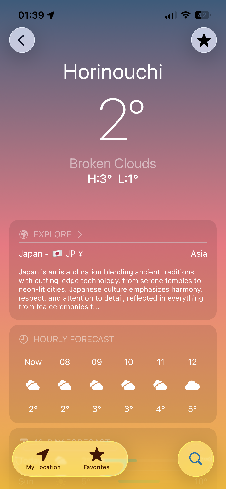
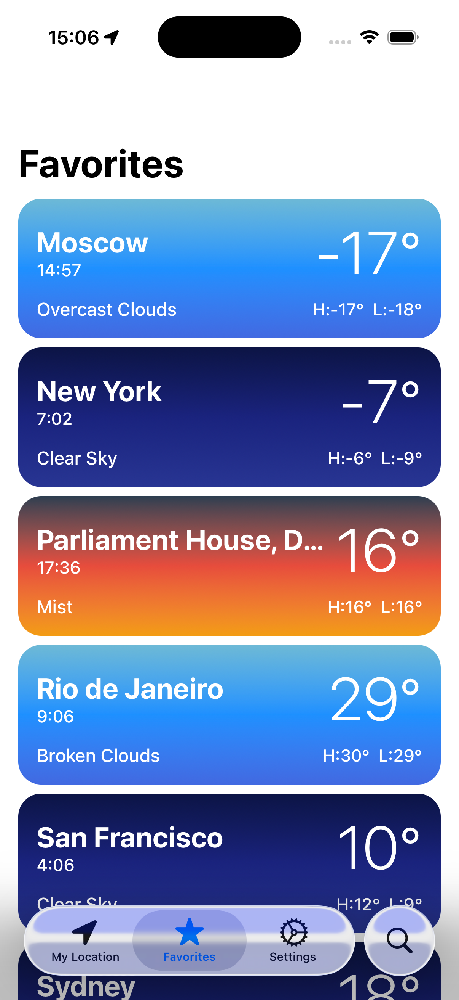
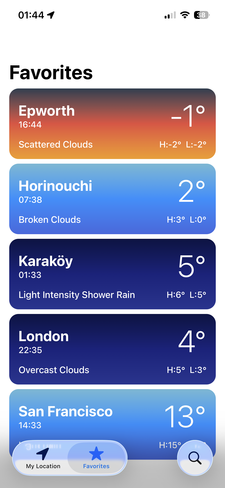

# 🌤️ Atlas Weather

A weather app built with SwiftUI that provides real-time weather data and country information.  
App icon designed utilizing the [Weather Icon Set by Thanh Thiện](https://www.figma.com/community/file/968435532356955987/weather), available via Figma Community.

## Screenshots

  
  
  
  

## Features
- Current weather conditions
- Hourly & daily forecasts
- City search
- Explore country details with popular images
- Add locations to favorites
- Change time, unit system and more settings

## Tech Stack
- SwiftUI
- MVVM Architecture
- OpenWeatherMap API (Weather + Geocoding)
- Unsplash API

## Requirements
- Minimum Deployment Target: iOS 16.0+
- Swift 5+
- OpenWeatherMap API Key
- Unsplash API Key

## Setup
1. Clone the repository
2. Open `Atlas Weather.xcodeproj`
3. Fallow the guide in `Secrets_example.swift`
4. Build and run

## API Key
Get your free OpenWeatherMap API key from [openweathermap.com](https://openweathermap.org/api)  
Get your free Unsplash API key from [unsplash.com](https://unsplash.com/developers)
